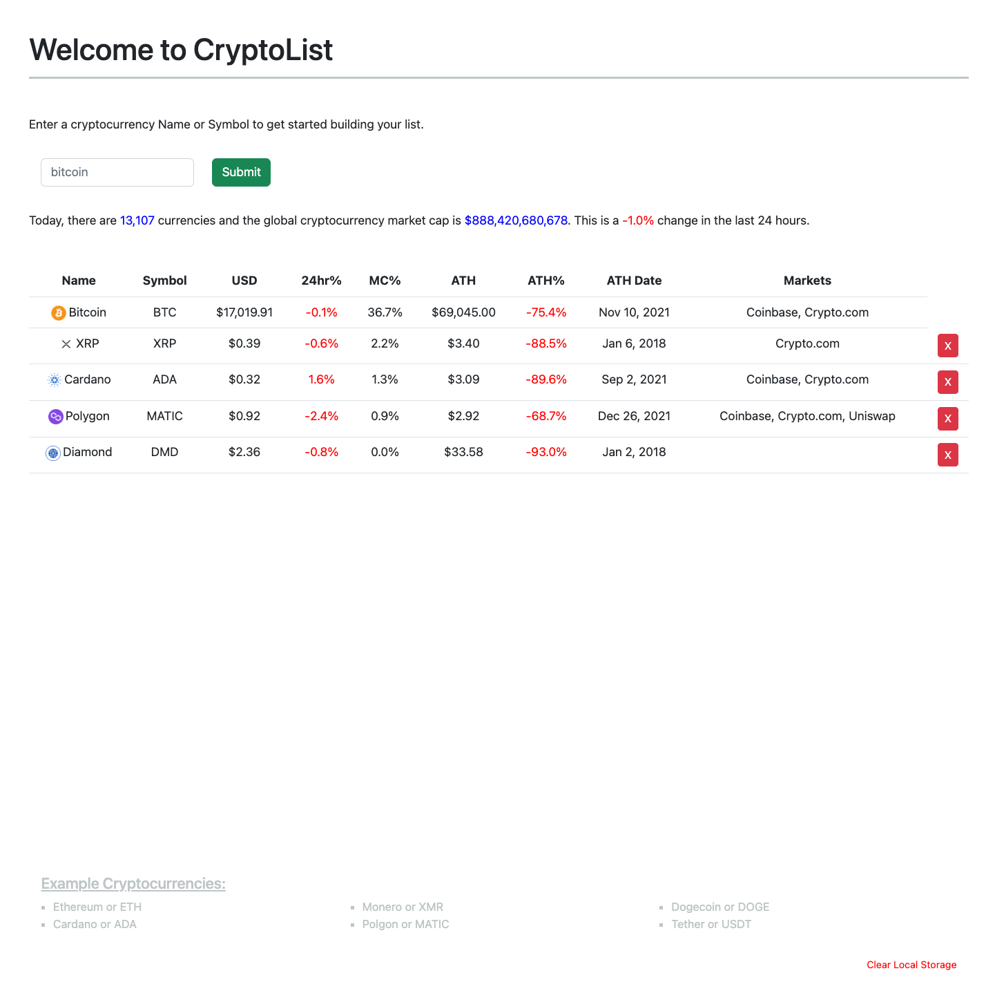

# CryptoList
--- 

CryptoList is an early stage beta for a fully formed crypto currency research and portfolio management solution. The primary purpose of this app is to beta user input and API queries. This project is based on an automated spreadsheet used to manage cryptocurrency research, price monitoring, and portfolio management over a six year period. 

## Technologies Used: 
--- 

- HTML
- CSS
- JavaScript
- jQuery
- AJAX
- [LocalStorage](https://developer.mozilla.org/en-US/docs/Web/API/Window/localStorage)
- [CoinGecko API](https://www.coingecko.com/en/api)

## Screenshot(s):
--- 
CryptoList Main Page Wireframe:

## Getting Started: 
--- 

A live version of this app is hosted on [Github.io.](https://pclarytx10.github.io) Example cryptocurrencies have been provided on the landing page. Simply type a coin in the submit box to get started. Added coins may be removed by clicking the remove button on the right hand side of the row.

### Features:
--- 

- [x] User input form
  - [x] Currency Name or Symbol
- [x] Basic Reporting
  - [x] Currency List
- [x] AJAX query to CoinGecko

### Stretch Goals:

- [x] Add Coin Image to Table Row
- [ ] Add logic to test for all "Approved US Markets"
- [ ] LocalStorage of User Input
  - [ ] Refresh of value on new page load
  
### Future Enhancements:

- [ ] Research Tracking
  - [ ] Research Source
  - [ ] Research Notes
  - [ ] Risk Level
    - [ ] RL Automation (Market Cap, Social Score, Etc.)
- [ ] Position Tracking
  - [ ] Exchange or Wallet
  - [ ] Custodial or Non-Custodial  
  - [ ] Position Size vs Portfolio
  - [ ] Risk Level 
    - [ ] RL Automation (Coin RL, Position Size, Custodial Factors)
- [ ] Advanced Reporting
  - [ ] Portfolio Sizing
  - [ ] Graphs

Research Dashboard: (Future Reporting)

Position Size Reporting(Future):

## Project MVP Description and Rubric
--- 

Your application must meet these requirements in order to be considered passing:

- [x] Render an application in the browser (Deployed using GH Pages, Netlify or Vercel).
- [x] Built with HTML, CSS & JavaScript (jQuery) and organized into seperate files.
- [x]  Have properly indented HTML, CSS & JavaScript.
- [x]  Have functions and variables that are named sensibly (nouns make the best variable names and verbs for function names).
- [x] Use AJAX to make a request to an external data source like OMDBapi and insert some of the data retrieved into the DOM.
- [x] Frequent commits (5 minimum) dating back to the very beginning of the project. Commit messages should be in the present tense. So, for example "adds link", "creates display of API data", or "prepares for deployment".
- [x] A README.md file with these sections:
  - [x]  <Your app's title>: A description of your app. Background info of the app is a nice touch.
  - [x] Technologies Used: List of the technologies used, e.g., JavaScript, HTML, CSS...
  - [x] Screenshot(s): Images of your actual app.
  - [x] Getting Started: In this section include the link to your deployed app and any instructions you deem important.
  - [x] Future Enhancements: Features you plan to implement later.
    Note: Don't underestimate the value of a well crafted README.md. 
